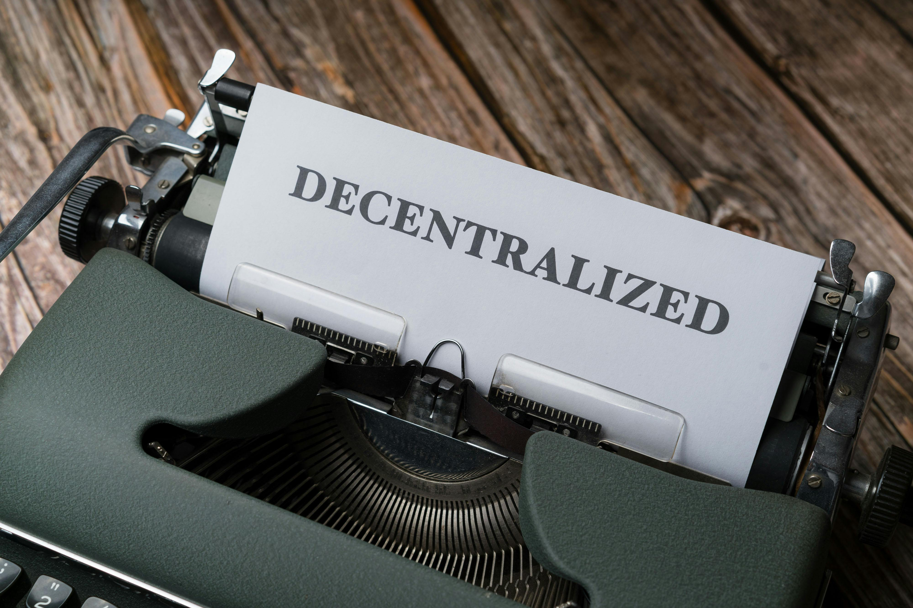

# The Role of Smart Contracts in Revolutionizing Finance: How Automation Powers DeFi

---

## Introduction

In the rapidly evolving world of blockchain technology, one innovation stands out as a game-changer: **smart contracts**. These self-executing contracts form the backbone of **Decentralized Finance (DeFi)**, enabling financial transactions and services without intermediaries. From lending and borrowing to trading and insurance, smart contracts automate processes, enhance transparency, and reduce costs.

---

## What Are Smart Contracts?

A **smart contract** is a program stored on a blockchain that automatically executes predefined actions when certain conditions are met. Think of it as a digital agreement where the terms are coded and enforced by the blockchain.

Smart contracts were first popularized by **Ethereum**, a blockchain platform that enables developers to build decentralized applications (dApps). Unlike traditional contracts, smart contracts eliminate intermediaries such as lawyers or banks, directly enforcing agreements between parties.

---

## How Smart Contracts Work in DeFi

Smart contracts automate various financial services, transforming traditional processes. Here are three key use cases:

### 1. Lending and Borrowing

In traditional finance, getting a loan requires dealing with banks or financial institutions. In DeFi, platforms like **Aave** and **Compound** use smart contracts to automate lending. Users can deposit assets into a lending pool and earn interest, while borrowers can access loans by providing collateral. The smart contract handles all terms, such as interest rates and collateral thresholds.

### 2. Decentralized Exchanges (DEXs)

Smart contracts enable peer-to-peer cryptocurrency trading without centralized exchanges. Platforms like **Uniswap** and **SushiSwap** allow users to trade tokens directly through liquidity pools managed by smart contracts. The contracts match buyers and sellers and automatically adjust prices based on supply and demand.

### 3. Yield Farming and Staking

Yield farming allows users to earn rewards by providing liquidity to DeFi protocols. Smart contracts automate reward distribution based on the user’s contribution. Similarly, staking involves locking up assets to support network security, with smart contracts managing the reward payouts.

---

## Benefits of Smart Contracts in DeFi

Smart contracts bring several advantages that make them ideal for DeFi:

- **Elimination of Intermediaries:** By removing the need for banks or brokers, smart contracts reduce costs and increase efficiency.
- **Transparency and Trust:** Transactions are recorded on a public blockchain, ensuring transparency and fostering trust.
- **Automation and Efficiency:** Smart contracts execute automatically, reducing delays and human errors.
- **Security:** Once deployed, smart contracts are immutable and tamper-proof, enhancing security.

---

## Challenges and Risks

Despite their benefits, smart contracts come with challenges:

- **Code Vulnerabilities:** Bugs or vulnerabilities in the code can be exploited, leading to financial losses.
- **Lack of Flexibility:** Once deployed, smart contracts cannot be changed, which makes updates difficult.
- **Regulatory Uncertainty:** The decentralized nature of smart contracts raises questions about how they should be regulated.
- **User Error:** Users interacting with smart contracts need to be careful, as mistakes can result in irreversible losses.

---

## The Future of Smart Contracts

Smart contracts are expected to play an even larger role in the future as blockchain technology advances. Innovations such as **Layer 2 solutions** (e.g., Optimism and Arbitrum) aim to enhance scalability, making smart contracts faster and cheaper.

Beyond finance, smart contracts have potential applications in **real estate**, **supply chain management**, **insurance**, and **healthcare**. As adoption grows, they will likely become a standard feature in many industries.

---

## Conclusion

Smart contracts are revolutionizing financial services, laying the foundation for a more decentralized, transparent, and efficient system. Their role in DeFi is just the beginning. As technology evolves and more people embrace decentralization, smart contracts will become a cornerstone of the digital economy.

**Ready to explore DeFi and smart contracts?** Start by checking out platforms like **Aave**, **Uniswap**, or **Compound**. Embrace the future of finance powered by automation and innovation.
